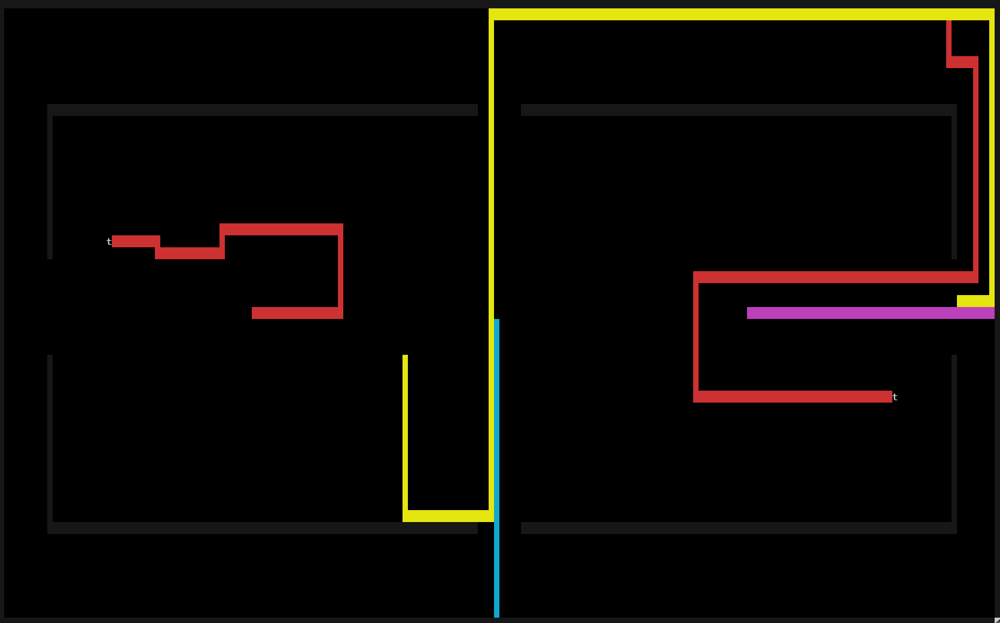
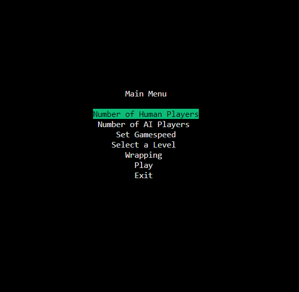

# jSnake



## Dependencies

Install `ncurses`. On debian based distros like ubuntu for example:

```bash
apt-get install libncurses5-dev
```

Install build tools. On debian based distros like ubuntu for example:

```bash
sudo apt install g++ make
```

## Play

The game expects an approximately 16x9 aspect ratio for the terminal. Make sure to resize the window as appropriate.

```bash
make
./jSnake.app
```

Navigate the menus using the `up` and `down` arrows. Press `enter` to select an option and `backspace` to move to the previous menu.


